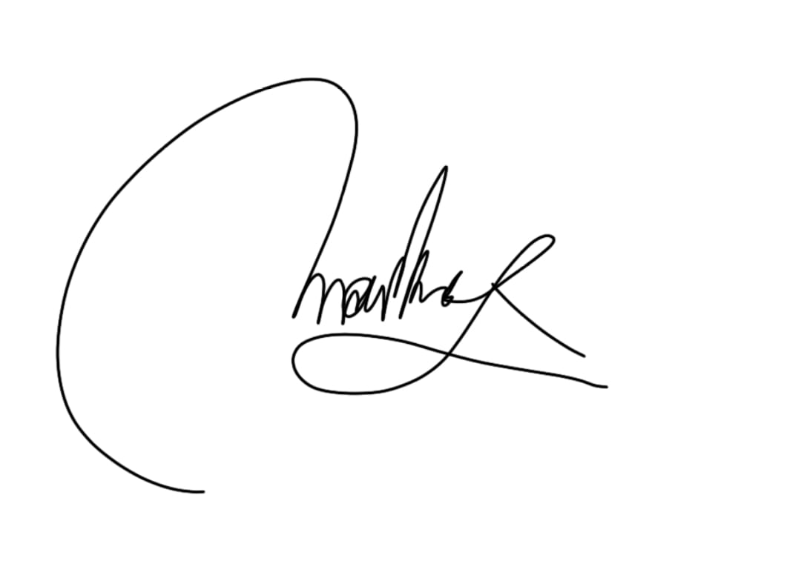
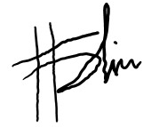
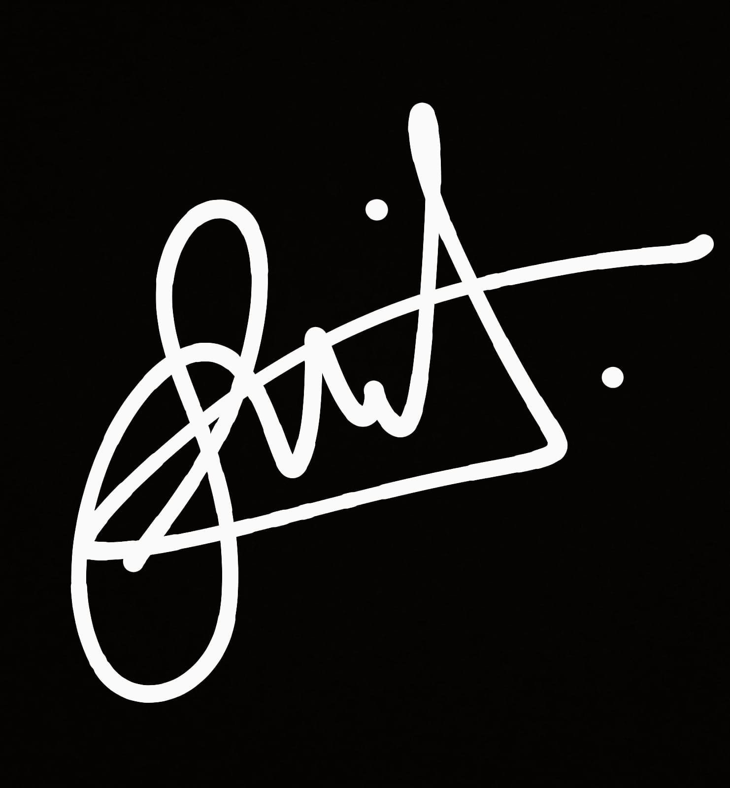

# Deklarasi Penggunaan AI

## Tugas Besar IF2150 - Rekayasa Perangkat Lunak

| Informasi            | Keterangan   |
| -------------------- | ------------ |
| Kelas                | _K1_         |
| Nomor Kelompok       | _9_          |
| Nama Kelompok        | _PindahCSUI_ |
| Nama Perangkat Lunak | PeerUP       |

**Anggota Kelompok:**

| NIM        | Nama                              |
| ---------- | --------------------------------- |
| _13525049_ | _Hugo Daniel Johansen Napitupulu_ |
| _13525001_ | _Matthew Allen Reynaldo_          |
| _13525010_ | _Fabian Amzar Susanto_            |
| _13525025_ | _David Christian_                 |
| _13525028_ | _Markus Christiano Simanjutak_    |
Fabian_Amzar_Susanto     
---

### Daftar Isi
* [Milestone 1](#milestone-1)
* Notes: Copy bagian Daftar Isi seperti Milestone 1 untuk Milestone berikutnya, contoh ``* [Milestone 2](#milestone-2)``. Ketika Daftar isi diklik maka akan langsung diarahkan ke bagian bawah sesuai dengan Milestone tujuan.

---

### Log Penggunaan AI per Milestone

Silakan catat penggunaan AI yang berdampak signifikan pada pengerjaan tugas (misal: *generate* fungsi algoritma yang kompleks, *generate* draf dokumen SKPL/DPPL, atau *debugging* error utama). 
*Penggunaan sepele seperti memperbaiki *typo* atau auto-complete satu baris kode tidak perlu dicatat.*

### Milestone 1
| Tool AI | Tujuan Penggunaan | Contoh Prompt Utama | Modifikasi & Validasi Manusia |
| :--- | :--- | :--- | :--- |
| *[Nama AI]* | *[Sertakan Tujuan Penggunaan]* | *[Tuliskan Prompt Utama]* | *[Tuliskan Keputusan Hasil Validasi]* |
| *Gemini* | *Membantu menyempurnakan tata bahasa dan struktur kalimat pada draf kasar Latar Belakang Masalah agar lebih akademis.* | *"Tolong perbaiki tata bahasa paragraf ini agar lebih baku dan cocok untuk dokumen spesifikasi akademis, tanpa mengubah ide utamanya: [draf tulisan kami]."* | *AI memberikan hasil yang kosakatanya terlalu kaku. Kami menyesuaikan kembali beberapa istilah agar lebih luwes dibaca dan memastikan argumen orisinal kelompok kami tidak hilang.* |
| *Gemini* | *Merapikan format penulisan daftar pustaka di bagian Referensi menjadi APA Style yang rapi.* | *"Tolong ubah daftar link jurnal penelitian dan artikel berita berikut ini menjadi format sitasi APA Style yang benar."* | *Kami melakukan pengecekan silang terhadap hasil sitasi AI untuk memastikan urutan abjad, nama penulis, dan tahun terbitnya (2023-2024) sudah dicantumkan dengan tepat.* |
| *Gemini* | *Brainstorming sudut pandang tambahan terkait penentuan 'Asumsi dan Batasan' sistem pencocokan teman belajar.* | *"Berikan beberapa contoh batasan sistem yang umum ditemui pada aplikasi pencarian teman/matching app khusus edukasi."* | *AI menghasilkan daftar saran yang terlalu luas dan kompleks. Kami menolak sebagian besar saran teknisnya dan hanya mengadopsi batasan demografi pengguna serta tanggung jawab efektivitas belajar yang disesuaikan dengan scope tugas kami.* |
| *Gemini* | *Membantu menyusun tata bahasa dan merapikan format kalimat pada dokumen Log Penggunaan AI (dokumen AI Usage).* | *"Bantu perbaiki kalimat draf kasar untuk tabel log AI ini agar penyampaiannya terdengar profesional, jujur, dan tidak berlebihan: [draf kasar kalimat kami]."* | *AI memberikan draf kalimat yang kaku dan cenderung melebih-lebihkan perannya. Kami memodifikasi dan memangkas deskripsi tersebut agar lebih singkat, natural, dan benar-benar merepresentasikan porsi kerja tim kami.* |
| | | | | |

### Milestone 2
| Tool AI | Tujuan Penggunaan | Contoh Prompt Utama | Modifikasi & Validasi Manusia |
| :--- | :--- | :--- | :--- |
| | | | | |
| | | | | |

---
### Pernyataan Integritas dan Persetujuan

Kami yang bertanda tangan di bawah ini menyatakan bahwa seluruh log penggunaan AI di atas adalah benar. Kami telah memvalidasi seluruh hasil AI dan bertanggung jawab penuh atas orisinalitas, keamanan, dan kebenaran hasil akhir dari tugas ini.

| Tanda Tangan | Nama Anggota |
| :---: | :--- |
|  | **[NIM - Nama Anggota 1]** |
|  | **[NIM - Nama Anggota 2]** |
|  | **[NIM - Nama Anggota 3]** |
|  | **[NIM - Nama Anggota 4]** |
|  | **[NIM - Nama Anggota 5]** |