<h1>
IF2150 REKAYASA PERANGKAT LUNAK
 
TUGAS 4
 
CLASS DIAGRAM
</h1>
 

## PeerUP

## Daftar Perubahan

| Revisi | Deskripsi |
| :--- | :--- |
| *A* | *Ditambahkan US-24, A15, R25, dan KF18, UC13 untuk merealisasikan fitur melihat feedback sebagai Mentor.* |
| *B* |  |
| *C* |  |
| ... |  |

 
 

# BAB 1: Deskripsi Perangkat Lunak
PeerUP adalah sebuah perangkat lunak berbasis platform digital yang dirancang untuk memfasilitasi pembelajaran kolaboratif (peer-to-peer tutoring). PeerUp akan menjadi platform untu mempertemukan pelajar yang membutuhkan bantuan pemahaman materi tertentu dengan tutor sebaya yang memiliki penguasaan materi lebih baik, jadwal yang selaras, dan preferensi belajar yang cocok. Hal ini akan membuat kedua belah pihak dapat belajar bersama dan bahkan membuat study group sendriri  

Secara naratif, alur kerja sistem ini dimulai ketika pengguna (tutor ataupun pelajar) membuat sebuah akun dan mengatur profil mereka. Siswa (Mentee) kemudian dapat mengisi preferensi sesi tutoring (kebutuhan materi, ketersediaan waktu, sesi online offline) dan memilih sesi yang tersedia. Sementara itu tutor (mentor) dapat Membuat sesi dengan menyertakan keterangan (topik materi, jadwal sesi, sesi online/offline, kapasitas maksimum peserta). Sistem akan mencocokkan para mentee dengan mentor yang sesuai dengan preferensi satu sama lain. Selain itu, sebuh group chat sesi sementara akan dibuat oleh sistem untuk menjadi sarana mereka berkomunikasi tentang sesi mereka. Setelah ini, mereka dapat merencakanakan sesi belajar bersama mereka sesuai dengan persetujuan satu sama lain.

Dari sisi mahasiswa atau peserta didik, mereka mengekspektasikan sebuah metode pembelajaran yang efektif dan mudah dibentuk. Selain itu, mereka juga mengekspektasikan sebuah lingkungan belajar yang lebih interaktif, organik, dan mudah dibentuk, bukan sekadar dipaparkan materi secara pasif satu arah. Mereka. Dengan adanya platform ini, mereka dapat dengan mudah membentuk study group sendiri dan mendapatkan pembelajaran yang naturan dari orang-orang sebaya mereka.

Sementara itu, dari sisi tutor, ekspektasinya adalah mendapatkan wadah untuk menambah pengalaman mengajar (volunteering experience), memperluas relasi, dan berpotensi mendapatkan insentif tambahan secara mandiri.

Harapan dari penerapan solusi ini adalah platform ini mampu memfasilitasi para pelajar untuk menemukan study buddy atau group belajar yang paling cocok dengan preferensi mereka masing-masing, menggantikan batasan biaya bimbingan dan subskripsi aplikasi pembelajaran yang mahal, demi mencapai menuntut ilmu bersama-sama.

---

# BAB 2: Kebutuhan Fungsional

## 2.1 Kebutuhan Fungsional

Salin ulang seluruh Kebutuhan Fungsional (KF) yang telah dirumuskan pada dokumen sebelumnya, lengkap dengan ID KF, ID Kebutuhan (mengacu ke ID pada tabel Pemetaan Kebutuhan di dokumen *Requirement Gathering*), dan penjelasannya.

Pada bagian ini, Anda diperbolehkan untuk menyalin dari dokumen sebelumnya.

 ***Catatan***: *Kebutuhan ditulis mengikuti pola EARS. Pada contoh di bawah, sebagian besar KF dipicu oleh satu aksi pelanggan, sehingga memakai pola event-driven "Ketika ⟨pemicu⟩, sistem harus ⟨respons⟩".*

Tabel 2.1. Daftar Kebutuhan Fungsional

| ID KF | ID Kebutuhan | Penjelasan |
| :--- | :--- | :--- |
| *KF01* | *R01, R02, R04* | *Ketika pengguna melakukan registrasi akun baru, sistem harus memvalidasi alamat email universitas, memvalidasi pembuatan akunnya, dan membuat akun baru.* |
| *KF02* | *R03, R05* | *Ketika pengguna memasukkan kredensial yang sesuai dengan database sistem untuk login ke perangkat lunak, sistem harus memberikan hak akses akun pengguna dan mengarahkan pengguna ke beranda.* |
| *KF03* | *R17* | *Sistem harus merekam dan memodifikasi tag preferensi materi pelajaran pada profil pengguna (Mentor dan Mentee).* |
| *KF04* | *R18* | *Sistem harus menyimpan data ketersediaan waktu yang dipilih pengguna ke dalam kalender internal sistem.* |
| *KF05* | *R06* | *Ketika Mentor menekan tombol simpan sesi baru, sistem harus merekam detail sesi: topik, jadwal, format (daring/luring), dan batas peserta.* |
| *KF06* | *R07* | *Jika Mentor mengatur waktu sesi yang saling bertabrakan, maka sistem harus menolak masukan dan menampilkan peringatan.* |
| *KF07* | *R19* | *Sistem harus menampilkan hasil matchmaking jadwal dan materi pengguna dalam bentuk daftar rekomendasi.* |
| *KF08* | *R08, R20* | *Ketika Mentee memilih untuk mengikuti sebuah sesi, sistem harus mendaftarkannya sebagai anggota dan memunculkan informasi detail sesi tersebut.* |
| *KF09* | *R09* | *Ketika waktu menunjukkan 15 menit sebelum sesi dimulai, sistem harus mengirimkan notifikasi pengingat kepada seluruh partisipan sesi tersebut.* |
| *KF10* | *R11, R12, R14* | *Ketika sebuah sesi telah selesai ataupun melewati batas waktu pelaksanaannya, sistem harus menampilkan formulir konfirmasi otomatis dan formulir penilaian.* |
| *KF11* | *R13* | *Sistem harus menampilkan daftar riwayat sesi yang pernah diikuti atau dibuat pada halaman profil pengguna.* |
| *KF12* | *R15, R16* | *Ketika sebuah sesi berhasil dibentuk dan disetujui, sistem harus secara otomatis membuat group chat sementara bagi pesertanya.* |
| *KF13* | *R21* | *Jika jumlah partisipan sesi telah mencapai batas kapasitas maksimum yang ditetapkan Mentor, sistem harus menolak permintaan bergabung dari Mentee selanjutnya dan menampilkan notifikasi sesi penuh.* |
| *KF14* | *R22* | *Jika Mentor memasukkan jumlah partisipan yang tidak valid saat pembuatan sesi (minimum 1 partisipan dan maksimum 20 partisipan), sistem harus menolak masukan dan menampilkan peringatan.* |
| *KF15* | *R23* | *Ketika Mentee mengonfirmasi pembatalan keikutsertaan pada suatu sesi, maka sistem harus menghapus data Mentee tersebut dari basis data pendaftar sesi.* |
| *KF16* | *R23* | *Ketika Mentor mengonfirmasi penghapusan sesi buatannya, sistem harus menghapus sesi tersebut dan memperbarui basis data agar tidak lagi ditampilkan.* |
| *KF17* | *R24* | *Ketika Mentor menyimpan pembaruan data sesi, sistem harus merekam revisi tersebut ke dalam basis data agar rincian terbaru segera ditampilkan.* |
| *KF18* | *R24* | *Ketika Mentor mengakses riwayat sesi yang telah selesai, sistem harus menampilkan riwayat penilaian yang diberikan oleh Mentee.* |
---

# BAB 3: Model Use Case

## 3.1 Identifikasi Aktor

Tuliskan kembali daftar aktor yang terlibat dan deskripsi perannya dalam perangkat lunak (P/L). Deskripsi peran harus menjelaskan wewenang aktor tersebut dalam perangkat lunak. Perlu diingat bahwa aktor yang dimaksud adalah pengguna yang berinteraksi langsung dengan P/L. Komponen seperti database, payment gateway, atau library bukan aktor.

Pada bagian ini, Anda diperbolehkan untuk menyalin dari dokumen sebelumnya.

| Aktor | Deskripsi |
| :--- | :--- |
| *Mentee (Siswa/Mahasiswa)* | *Pengguna yang bertindak sebagai pihak yang membutuhkan bimbingan atau rekan belajar. Mentee berinteraksi dengan sistem untuk mengatur preferensi materi dan jadwal, mencari rekomendasi sesi (matchmaking), bergabung ke dalam sesi, serta memberikan penilaian (rating) setelah sesi selesai.* |
| *Mentor (Tutor)* | *Pengguna sebaya yang memiliki penguasaan materi lebih dan bersedia meluangkan waktu untuk mengajar. Mentor berinteraksi dengan sistem untuk membuat sesi belajar baru, menetapkan jadwal dan batas maksimum peserta, serta mengonfirmasi keterlaksanaan sesi.* |

## 3.2 Identifikasi Use Case

Use case berfungsi untuk mendeskripsikan interaksi aktor-aktor yang terlibat dengan sistem. Isi daftar use case dan deskripsi singkatnya dalam tabel di bawah.

Pada bagian ini, Anda diperbolehkan untuk menyalin dari dokumen sebelumnya.

| ID UC | Nama Use Case | Deskripsi Singkat | Aktor Terlibat | ID KF Terkait |
| :--- | :--- | :--- | :--- | :--- |
| *UC01* | *Mendaftarkan Akun dan Autentikasi* | *Pengguna mendaftarkan akun baru menggunakan email universitas dan login ke dalam perangkat lunak.* | *Mentor, Mentee* | *KF01,KF02* |
| *UC02* | *Mengelola Preferensi Profil* | *Pengguna mengatur dan menyimpan tag materi pelajaran serta ketersediaan waktu mereka masing-masing.* | *Mentee, Mentor* | *KF03, KF04* |
| *UC03* | *Membuat Sesi Belajar* | *Mentor mengatur detail sesi baru seperti topik, jadwal, format, dan batasan jumlah peserta.* | *Mentor* | *KF05, KF06, KF14* |
| *UC04* | *Mencari dan Bergabung ke Sesi* | *Mentee melihat daftar rekomendasi sesi yang cocok dengan preferensinya, lalu mendaftar ke sesi yang dia inginkan.* | *Mentee* | *KF07, KF08, KF13* |
| *UC05* | *Mengonfirmasi Keterlaksanaan Sesi* | *Pengguna menandai dan mengonfirmasi apakah sesi yang telah dijadwalkan benar-benar terlaksana.* | *Mentor, Mentee* | *KF10* |
| *UC06* | *Melihat Riwayat Sesi* | *Pengguna melihat daftar sesi yang sedang berjalan, selesai, atau dibatalkan.* | *Mentor, Mentee* | *KF11* |
| *UC07* | *Memberikan Penilaian Sehabis Sesi* | *Pengguna memberi penilaian dan catatan terhadap sesi yang telah dikonfirmasi selesai.* | *Mentor, Mentee* | *KF10* |
| *UC08* | *Berkomunikasi Menggunakan Grup Obrolan Sementara* | *Pengguna bertukar pesan dalam grup obrolan sementara yang dibuat untuk suatu sesi belajar.* | *Mentor, Mentee* | *KF12* |
| *UC09* | *Menerima Notifikasi Sesi* | *Pengguna mendapatkan pengingat otomatis sebelum sesi belajar dimulai.* | *Mentor, Mentee* | *KF09* |
| *UC10* | *Membatalkan Keikutsertaan Sesi* | *Mentee dapat membatalkan pengikutsertaan sesi yang sudah didaftarkan sebelumnya* | *Mentee* | *KF15* |
| *UC11* | *Menghapus Sesi* | *Mentor dapat menghapus sesi yang sudah dibuat sebelumnya* | *Mentor* | *KF16* |
| *UC12* | *Mengedit Sesi* | *Mentor dapat mengedit sesi yang sudah dibuat sebelumnya untuk mengganti jadwal atau rincian sesi* | *Mentor* | *KF17, KF06, KF14* |
| *UC13* | *Melihat Feedback Sesi* | *Mentor dapat mengakses dan membaca feedback yang dirancang oleh Mentee pada sesi yang telah selesai.* | *Mentor* | *KF18* |

## 3.3 Use Case Diagram
Buatlah diagram use case keseluruhan berdasarkan identifikasi use case beserta aktor yang melakukan use case tersebut. Perhatikan garis `<<extend>>` dan `<<include>>`.

Pada bagian ini, Anda diperbolehkan untuk menyalin dari dokumen sebelumnya.

 

<i>Gambar 1. Use Case Diagram PeerUp</i>

 

## 3.4 Skenario Use Case
Salin ulang skenario **setiap** use case (skenario normal dan alternatif) dari dokumen *Use Case & Scenario Use Case*. Skenario ini menjadi dasar penentuan atribut dan metode/operasi kelas pada BAB 4.

Pada bagian ini, Anda diperbolehkan untuk menyalin dari dokumen sebelumnya.

### 3.4.1 Skenario UC01
 
**Nama Use Case:** *Mendaftarkan Akun dan Autentikasi*
 
**Skenario Normal**
 
| No | Aksi Aktor | Reaksi Perangkat Lunak |
| :--- | :--- | :--- |
| 1 | *Pengguna memilih opsi "Daftar", lalu memasukkan alamat email universitas, kata sandi, dan data profil* | *Sistem memvalidasi format email universitas dan merekam persetujuan data* |
| 2 | *Pengguna menekan "Simpan"* | *Sistem membuat akun baru, lalu mengarahkan pengguna ke halaman Login* |
| 3 | *Pengguna memasukkan email dan kata sandi di halaman Login, lalu menekan "Masuk"* | *Sistem memverifikasi kredensial yang dimasukkan* |
| 4 | *Pengguna menunggu proses masuk* | *Sistem memberikan hak akses akunnya dan menampilkan halaman beranda aplikasi* |
 
 

**Skenario Alternatif 1: Email Universitas Tidak Valid**
 
| No | Aksi Aktor | Reaksi Perangkat Lunak |
| :--- | :--- | :--- |
| 1 | *Pengguna memilih opsi "Daftar", lalu memasukkan email publik (misal: @gmail.com) dan data profil* | *Sistem memvalidasi format email* |
| 2 | *Pengguna melihat notifikasi peringatan* | *Sistem menolak masukan dan menampilkan notifikasi "Harap gunakan email institusi universitas yang valid"* |

### 3.4.2 Skenario UC02
 
**Nama Use Case:** *Mengelola Preferensi Profil*
 
**Skenario Normal**
 
| No | Aksi Aktor | Reaksi Perangkat Lunak |
| :--- | :--- | :--- |
| 1 | *Pengguna membuka halaman "Profil" dan memilih opsi "Edit Preferensi"* | *Sistem menampilkan antarmuka pemilihan preferensi: tag materi pelajaran, format, kalender ketersediaan waktu* |
| 2 | *Pengguna memilih beberapa tag materi, memilih format sesi yang diinginkan, dan menandai blok waktu kosong pada kalender, lalu menekan "Simpan"* | *Sistem memvalidasi perubahan* |
| 3 | *Pengguna melihat pembaruan profil* | *Sistem merekam pembaruan tag, pemilihan format, dan menyimpan kalender waktu ke database, lalu memunculkan notifikasi "Preferensi berhasil disimpan"* |

 

**Skenario Alternatif 1: Menyimpan Preferensi Tanpa Memilih Preferensi**
 
| No | Aksi Aktor | Reaksi Perangkat Lunak |
| :--- | :--- | :--- |
| 1 | *Pengguna membuka halaman "Profil" dan memilih opsi "Edit Preferensi"* | *Sistem menampilkan antarmuka pemilihan* |
| 2 | *Pengguna mengosongkan sebagian atau seluruh pilihan preferensi, lalu menekan "Simpan"* | *Sistem mendeteksi bahwa pilihan preferensi masih kosong* |
| 3 | *Pengguna melihat notifikasi peringatan* | *Sistem menunda penyimpanan dan menampilkan notifikasi peringatan "Silahkan Isi Semua Pilihan Preferensi"* |

### 3.4.3 Skenario UC03

**Nama Use Case:** *Membuat Sesi Belajar*

**Skenario Normal**

| No | Aksi Aktor | Reaksi Perangkat Lunak |
| :--- | :--- | :--- |
| 1 | *Mentor memilih menu "Buat Sesi Baru"* | *Sistem menampilkan formulir pembuatan sesi (topik, jadwal, format daring/luring, dan batas peserta)* |
| 2 | *Mentor mengisi seluruh form dengan valid dan menekan "Simpan"* | *Sistem memvalidasi masukan formulir* |
| 3 | *Mentor menunggu konfirmasi* | *Sistem merekam detail sesi ke dalam database dan menampilkan pesan "Sesi berhasil dibuat"* |

 

**Skenario Alternatif 1: Kapasitas Peserta Melebihi Batas Maksimum**

| No | Aksi Aktor | Reaksi Perangkat Lunak |
| :--- | :--- | :--- |
| 1 | *Mentor memilih menu "Buat Sesi Baru"* | *Sistem menampilkan formulir pembuatan sesi (topik, jadwal, format daring/luring, dan batas peserta)* |
| 2 | *Mentor mengisi form namun memasukkan batas peserta sebanyak 135 orang, lalu menekan "Simpan"* | *Sistem memvalidasi masukan formulir dan mendeteksi pelanggaran batas aturan bisnis (maksimal 20)* |
| 3 | *Mentor melihat peringatan* | *Sistem menolak masukan, tidak menyimpan data, dan menampilkan pesan kesalahan "Kapasitas maksimal adalah 6 orang"* |
| 4 | *Mentor memperbaiki angka menjadi 9 orang dan menekan "Simpan"* | *Sistem kembali ke langkah 3 pada Skenario Normal* |

 

**Skenario Alternatif 2: Kapasitas Peserta Kurang dari Batas Minimum**

| No | Aksi Aktor | Reaksi Perangkat Lunak |
| :--- | :--- | :--- |
| 1 | *Mentor memilih menu "Buat Sesi Baru"* | *Sistem menampilkan formulir pembuatan sesi (topik, jadwal, format daring/luring, dan batas peserta)* |
| 2 | *Mentor mengisi form namun memasukkan batas peserta sebanyak 0 orang, lalu menekan "Simpan"* | *Sistem memvalidasi masukan formulir dan mendeteksi pelanggaran batas aturan* |
| 3 | *Mentor melihat peringatan* | *Sistem menolak masukan, tidak menyimpan data, dan menampilkan pesan kesalahan "Kapasitas minimum adalah 1 orang"* |
| 4 | *Mentor memperbaiki angka menjadi 9 orang dan menekan "Simpan"* | *Sistem kembali ke langkah 3 pada Skenario Normal* |

 

**Skenario Alternatif 3: Waktu Sesi Bertabrakan**   

| No | Aksi Aktor | Reaksi Perangkat Lunak |
| :--- | :--- | :--- |
| 1 | *Mentor memilih menu "Buat Sesi Baru"* | *Sistem menampilkan formulir pembuatan sesi (topik, jadwal, format daring/luring, dan batas peserta)* |
| 2 | *Mentor mengisi form namun memilih jadwal yang bertabrakan dengan sesi miliknya yang lain, lalu menekan "Simpan"* | *Sistem memvalidasi masukan formulir dan mendeteksi adanya tabrakan jadwal* |
| 3 | *Mentor melihat peringatan* | *Sistem menolak masukan, tidak menyimpan data, dan menampilkan pesan kesalahan "Jadwal bertabrakan dengan sesi lain"* |
| 4 | *Mentor mengubah jam/tanggal pada formulir dan menekan "Simpan" sehingga jadwalnya tidak bertabrakan lagi* | *Sistem kembali ke langkah 3 pada Skenario Normal* |

### 3.4.4 Skenario UC04

**Nama Use Case:** *Mencari dan Bergabung ke Sesi*

**Skenario Normal**

| No | Aksi Aktor | Reaksi Perangkat Lunak |
| :--- | :--- | :--- |
| 1 | *Mentee membuka halaman "Cari Sesi"* | *Sistem mencocokkan (matchmaking) data profil Mentee dengan sesi yang tersedia* |
| 2 | *Mentee melihat daftar* | *Sistem menampilkan daftar rekomendasi sesi berdasarkan irisan kecocokan materi dan jadwal kosong"* |
| 3 | *Mentee memilih salah satu sesi dan menekan "Gabung Sesi"* | *Sistem memvalidasi ketersediaan slot pada sesi tersebut* |
| 4 | *Mentee menunggu konfirmasi* | *Sistem menambahkan Mentee ke dalam daftar partisipan sesi tersebut dan menampilkan notifikasi "Berhasil bergabung"* |

 

**Skenario Alternatif 1: Tidak Ada Rekomendasi Sesi yang Cocok**

| No | Aksi Aktor | Reaksi Perangkat Lunak |
| :--- | :--- | :--- |
| 1 | *Mentee membuka halaman "Cari Sesi"* | *Sistem mencoba mencocokkan (matchmaking) data profil Mentee dengan sesi yang tersedia* |
| 2 | *Mentee melihat halaman kosong* | *Sistem tidak menemukan irisan materi atau jadwal yang cocok, lalu menampilkan pesan "Belum ada sesi yang cocok dengan jadwalmu"* |
| 3 | *Mentee menekan tombol "Ubah Preferensi"* | *Sistem mengarahkan Mentee ke halaman pengaturan profil untuk mengubah ketersediaan waktu* |

### 3.4.5 Skenario UC05
 
**Nama Use Case:** *Mengonfirmasi Keterlaksanaan Sesi*
 
**Skenario Normal**
 
| No | Aksi Aktor | Reaksi Perangkat Lunak |
| :--- | :--- | :--- |
| 1 | *Pengguna membuka software setelah sesi selesai berdasarkan waktu yang tercatat pada sistem* | *Sistem menampilkan tombol konfirmasi "Terlaksana" dan "Tidak Terlaksana" pada sesi terkait* |
| 2 | *Pengguna memilih "Terlaksana"* | *Sistem mencatat status sesi menjadi "Selesai" beserta waktu konfirmasi* |
| 3 | *Pengguna menerima konfirmasi* | *Sistem menampilkan pesan "Status sesi berhasil diperbarui"* |
 
 
 

**Skenario Alternatif 1: Sesi Ditandai Tidak Terlaksana**
 
| No | Aksi Aktor | Reaksi Perangkat Lunak |
| :--- | :--- | :--- |
| 1 | *Pengguna membuka software setelah sesi selesai berdasarkan waktu yang tercatat pada sistem* | *Sistem menampilkan tombol konfirmasi "Terlaksana" dan "Tidak Terlaksana" pada sesi terkait* |
| 2 | *Pengguna memilih "Tidak Terlaksana"* | *Sistem menampilkan kolom alasan singkat yangg bersifat opsional* |
| 3 | *Pengguna mengisi alasan atau melewatinya, lalu menekan "Kirim"* | *Sistem mencatat status sesi menjadi "Tidak Terlaksana" beserta alasan yang diisi (optional)* |
| 4 | *Pengguna menerima konfirmasi* | *Sistem menampilkan pesan "Status sesi berhasil diperbarui"* |

### 3.4.6 Skenario UC06
 
**Nama Use Case:** *Melihat Riwayat Sesi*
 
**Skenario Normal**
 
| No | Aksi Aktor | Reaksi Perangkat Lunak |
| :--- | :--- | :--- |
| 1 | *Pengguna memilih menu "Riwayat"* | *Sistem mengambil seluruh data sesi milik Pengguna dari database* |
| 2 | *Pengguna menunggu data* | *Sistem menampilkan daftar sesi yang dikelompokkan berdasarkan status: Berlangsung, Terlaksana, dan Tidak Terlaksana* |
| 3 | *Pengguna memilih salah satu sesi pada daftar* | *Sistem menampilkan detail sesi tersebut, termasuk peran Pengguna (Mentor/Mentee), materi, jadwal, dan status* |
 
 

**Skenario Alternatif 1: Riwayat Kosong**
 
| No | Aksi Aktor | Reaksi Perangkat Lunak |
| :--- | :--- | :--- |
| 1 | *Pengguna memilih menu "Riwayat"* | *Sistem mengambil data sesi milik Pengguna dan tidak menemukan data pada salah satu atau seluruh kategori* |
| 2 | *Pengguna melihat halaman riwayat* | *Sistem menampilkan pesan "Belum ada sesi" * |

### 3.4.7 Skenario UC07
 
**Nama Use Case:** *Memberikan Penilaian Sehabis Sesi*
 
**Skenario Normal**
 
| No | Aksi Aktor | Reaksi Perangkat Lunak |
| :--- | :--- | :--- |
| 1 | *Pengguna membuka sesi yang telah berstatus "Selesai"* | *Sistem menampilkan form feedback beserta catatan opsional* |
| 2 | *Pengguna memberi feedback dan menuliskan catatan, lalu menekan "Kirim"* | *Sistem memvalidasi bahwa feedback telah diisi* |
| 3 | *Pengguna menunggu konfirmasi* | *Sistem menyimpan feedback dan menampilkan pesan "Terima kasih atas feedback Anda"* |
 
 

**Skenario Alternatif 1: Pengguna Tidak Mengisi Form Feedback**
 
| No | Aksi Aktor | Reaksi Perangkat Lunak |
| :--- | :--- | :--- |
| 1 | *Pengguna membuka sesi yang telah berstatus "Selesai"* | *Sistem menampilkan form feedback beserta catatan opsional dan tombol "Skip"* |
| 2 | *Pengguna menekan tombol "Skip" tanpa mengisi feedback* | *Sistem menutup form tanpa menyimpan feedback dan status sesi tetap "Selesai"* |

### 3.4.8 Skenario UC08
 
**Nama Use Case:** *Berkomunikasi Menggunakan Grup Obrolan Sementara*
 
**Skenario Normal**
 
| No | Aksi Aktor | Reaksi Perangkat Lunak |
| :--- | :--- | :--- |
| 1 | *Pengguna membuka menu "Pesan" dan memilih grup obrolan dari sesi yang telah terbentuk* | *Sistem menampilkan grup obrolan beserta riwayat pesan di dalamnya* |
| 2 | *Pengguna mengetikkan pesan, lalu menekan "Kirim"* | *Sistem menyimpan pesan ke database dan menampilkannya di layar obrolan seluruh anggota grup sesi terkait* |

 

**Skenario Alternatif 1: Grup Obrolannya Sudah Berakhir**
 
| No | Aksi Aktor | Reaksi Perangkat Lunak |
| :--- | :--- | :--- |
| 1 | *Pengguna mencoba membuka obrolan grup dari sesi yang telah selesai lebih dari 48 jam lalu* | *Sistem mendeteksi masa aktif sesi telah berakhir dan datanya sudah dihapus* |
| 2 | *Pengguna melihat peringatan dan mencoba membuka grup obrolan tersebut* | *Sistem menonaktifkan akses dan menampilkan pesan "Group chat untuk sesi ini telah berakhir"* |

### 3.4.9 Skenario UC09
 
**Nama Use Case:** *Menerima Notifikasi Sesi*
 
**Skenario Normal**
 
| No | Aksi Aktor | Reaksi Perangkat Lunak |
| :--- | :--- | :--- |
| 1 | *Pengguna sedang mengoperasikan perangkatnya saat waktu menunjukkan 15 menit sebelum sesi dimulai* | *Sistem mendeteksi pemicu waktu dan mengirimkan notifikasi pengingat ke akun partisipan terkait* |
| 2 | *Pengguna menekan notifikasi pengingat tersebut* | *Sistem mengarahkan pengguna ke halaman detail sesi belajar tersebut* |

(Catatan: UC09 tidak memiliki skenario alternatif karena ini murni sistem penyebaran informasi ke Pengguna).

### 3.4.10 Skenario UC10

**Nama Use Case:** *Membatalkan Mengikuti Sesi*
 
**Skenario Normal**
 
| No | Aksi Aktor | Reaksi Perangkat Lunak |
| :--- | :--- | :--- |
| 1 | *Mentee membuka detail sesi terdaftar yang belum dimulai.* | *Sistem menampilkan detail informasi sesi tersebut beserta tombol "Batalkan Keikutsertaan"* |
| 2 | *Mentee menekan tombol "Batalkan Keikutsertaan"* | *Sistem menampilkan pesan konfirmasi pembatalan* |
| 3 | *Mentee mengonfirmasi pembatalan dengan menekan "Ya, Batalkan"* | *Sistem menghapus data mentee tersebut dari database pendaftar sesi dan pesan "Berhasil Membatalkan Keikutsertaan" muncul* |

 

**Skenario Alternatif 1: Mentee tidak jadi membatalkan sesi**   
 
| No | Aksi Aktor | Reaksi Perangkat Lunak |
| :--- | :--- | :--- |
| 1 | *Mentee membuka detail sesi terdaftar yang belum dimulai.* | *Sistem menampilkan detail informasi sesi tersebut beserta tombol "Batalkan Keikutsertaan"* |
| 2 | *Mentee menekan tombol "Batalkan Keikutsertaan"* | *Sistem menampilkan pesan konfirmasi pembatalan* |
| 3 | *Mentee menekan tombol "Kembali"* | *Sistem menutup pesan dan tidak melakukan perubahan apapun* |

### 3.4.11 Skenario UC11

**Nama Use Case:** *Menghapus Sesi*
 
**Skenario Normal**
 
| No | Aksi Aktor | Reaksi Perangkat Lunak |
| :--- | :--- | :--- |
| 1 | *Mentor membuka detail sesi yang telah dia buat* | *Sistem menampilkan detail informasi sesi tersebut beserta tombol "Hapus Sesi"* |
| 2 | *Mentor menekan tombol "Hapus Sesi"* | *Sistem menampilkan pesan konfirmasi penghapusan sesi* |
| 3 | *Mentor mengonfirmasi penghapusan sesi dengan menekan tombol "Ya, Hapus"* | *Sistem menghapus dan menonaktifkan sesi tersebut, muncul pesan "Sesi Berhasil Dihapus"* |

 

**Skenario Alternatif 1: Mentor tidak jadi menghapus sesi**
 
| No | Aksi Aktor | Reaksi Perangkat Lunak |
| :--- | :--- | :--- |
| 1 | *Mentor membuka detail sesi yang telah dia buat* | *Sistem menampilkan detail informasi sesi tersebut beserta tombol "Hapus Sesi"* |
| 2 | *Mentor menekan tombol "Hapus Sesi"* | *Sistem menampilkan pesan konfirmasi penghapusan sesi* |
| 3 | *Mentor menekan tombol "Batal"* | *Sistem menutup pesan dan tidak terjadi perubahan apapun* |

### 3.4.12 Skenario UC12

**Nama Use Case:** *Mengedit Sesi*

**Skenario Normal**
 
| No | Aksi Aktor | Reaksi Perangkat Lunak |
| :--- | :--- | :--- |
| 1 | *Mentor membuka detail sesi yang telah dia buat* | *Sistem menampilkan detail informasi sesi tersebut beserta tombol "Edit Sesi"* |
| 2 | *Mentor menekan tombol "Edit Sesi"* | *Sistem menampilkan formulir yang sudah terisi dengan data sesi saat ini (topik, jadwal, batas peserta, dan lain-lain) serta tombol "Simpan Perubahan"* |
| 3 | *Mentor mengedit formulir yang ditampilkan dan mengonfirmasi perubahan dengan menekan tombol "Simpan Perubahan"* | *Sistem memperbarui database dengan data yang telah direvisi agar tampilan sesuai, lalu memunculkan pesan "Data Sesi Berhasil Diperbarui"* |

 

**Skenario Alternatif 1: Jadwal yang Direvisi Mentor Bertabrakan dengan Sesi Lain**
 
| No | Aksi Aktor | Reaksi Perangkat Lunak |
| :--- | :--- | :--- |
| 1 | *Mentor membuka detail sesi yang telah dia buat* | *Sistem menampilkan detail informasi sesi tersebut beserta tombol "Edit Sesi"* |
| 2 | *Mentor menekan tombol "Edit Sesi"* | *Sistem menampilkan formulir yang sudah terisi dengan data sesi saat ini (topik, jadwal, batas peserta, dan lain-lain) serta tombol "Simpan Perubahan"* |
| 3 | *Mentor mengubah jadwal sesi yang telah dibuat ke waktu yang berbenturan dengan sesi lain miliknya, lalu mengonfirmasi perubahan tersebut.* | *Sistem mendeteksi adanya tabrakan jadwal antarsesi dan menampilkan pesan peringatan tabrakan jadwal* |
| 4 | *Mentor menyesuaikan kembali jadwalnya ke waktu yang sesuai dan mengonfirmasi perubahan* | *Sistem memperbarui database dengan data yang telah direvisi agar tampilan sesuai, lalu memunculkan pesan "Data Sesi Berhasil Diperbarui"* |

 

**Skenario Alternatif 2: Jumlah Partisipan yang Direvisi Mentor Lebih Sedikit Batas Minimum yang Diperbolehkan**
 
| No | Aksi Aktor | Reaksi Perangkat Lunak |
| :--- | :--- | :--- |
| 1 | *Mentor membuka detail sesi yang telah dia buat* | *Sistem menampilkan detail informasi sesi tersebut beserta tombol "Edit Sesi"* |
| 2 | *Mentor menekan tombol "Edit Sesi"* | *Sistem menampilkan formulir yang sudah terisi dengan data sesi saat ini (topik, jadwal, batas peserta, dan lain-lain) serta tombol "Simpan Perubahan"* |
| 3 | *Mentor melakukan pengeditan terhadap batas maksimum peserta menjadi lebih sedikit dari batas minimum yang diperbolehkan dan mengonfirmasi perubahan tersebut* | *Sistem mendeteksi bahwa jumlah partisipan yang dimasukkan mentor lebih sedikit dari yang diperbolehkan, lalu menampilkan pesan peringatan jumlah partisipan terlalu sedikit* |
| 4 | *Mentor menyesuaikan kembali batas pesertanya, lalu mengonfirmasi perubahan* | *Sistem memperbarui database dengan data yang telah direvisi agar tampilan sesuai, lalu memunculkan pesan "Data sesi berhasil diperbarui"* |

### 3.4.13 Skenario UC13

**Nama Use Case:** *Melihat Feedback Sesi*

**Skenario Normal**
 
| No | Aksi Aktor | Reaksi Perangkat Lunak |
| :--- | :--- | :--- |
| 1 | *Mentor membuka detail sesi yang telah selesai pada riwayat sesi* | *Sistem menampilkan detail informasi sesi tersebut beserta tombol "Lihat Feedback"* |
| 2 | *Mentor menekan tombol "Lihat Feedback"* | *Sistem menampilkan semua feedback yang dibuat Mentee pada sesi tersebut (ditarik dari database Feedback)* |

 

(Catatan: UC13 tidak memiliki skenario alternatif).

---

# BAB 4: Diagram Kelas
Bagian ini berisi identifikasi kelas dan pemodelan struktur kelas yang diperlukan untuk merealisasikan use case pada BAB 3. Gunakan skenario use case (3.4) sebagai dasar untuk menentukan kelas, atribut, metode, dan hubungan antarkelas.

## 4.1 Identifikasi Kelas
Identifikasi seluruh kelas yang diperlukan berdasarkan use case dan skenarionya. Satu kelas boleh terkait dengan lebih dari satu use case.

| ID Kelas | Nama Kelas | Deskripsi Kelas | ID Use Case |
| :--- | :--- | :--- | :--- |
| *C01* | *User* | *Kelas parent yang merepresentasikan pengguna aplikasi (Mentor, Mentee) yang menyimpan informasi akun dasar seperti profil, email university, kata sandi, preferensi materi, dan schedule.* | *UC01, UC02, UC05, UC06, UC07, UC08, UC09* |
| *C02* | *Mentor* | *Kelas turunan dari User yang merepresentasikan tutor sebaya. Kelas ini memiliki hak untuk membaut sesi baru, mengedit sesi, dan menghapus sesi.* | *UC01, UC02, UC03, UC05, UC06, UC07, UC08, UC09, UC11, UC12,UC13* |
| *C03* | *Mentee* | *Kelas turunan dari User yang merepresentasikan siswa. Memiliki hak untuk mencari rekomendasi sesi, mendaftarkan ke sesi, serta membatalkan ikutsertaan sesi* | *UC01, UC02, UC04, UC05, UC06, UC07, UC08, UC09, UC10* |
| *C04* | *Session* | *Kelas yang merepresentasikan sesi belajar yang menyimpan atribut seperti topic materi, schedule, capacity, daftar peserta, dan status sesi* | *UC03, UC04, UC05, UC06, UC07, UC08, UC09, UC10, UC11, UC12, UC13* |
| *C05* | *GroupChat* | *Kelas yang merepresentasikan ruang obrolan sementara untuk komunikasi antar pengguna.* | *UC08* |
| *C06* | *Feedback* | *Kelas yang merepresentasikan rating dan ulasan yang diberikan oleh Mentee ataupun Mentor pada saat sebuah sesi belajar telah selesai.* | *UC07, UC13* |
| *C07* | *SessionHistory* | *Kelas yang menyimpan kumpulan riwayat sesi milik seorang pengguna dengan mengelompokkannya berdasarkan status (Berlangsung, Terlaksana, Tidak Terlaksana).* | *UC05, UC06, UC10, UC11, UC12, UC13* |
| *C08* | *ChatMessage* | *Kelas yang merepresentasikan pesan yang dikirimkan oleh pengguna ke dalam sebuah GroupChat. Menyimpan informasi pengirim, isi pesan teks, dan timestamp pesan dikirim.* | *UC08* |
| *C09* | *Preference* | *Kelas yang menyimpan pengaturan pengguna, seperti tag mata pelajaran, ketersediaan jadwal pada kalender, dan preferensi metode belajar (luring/daring) agar digunakan oleh algoritma matchmaking.* | *UC02, UC04* |
| *C10* | *Profile* | *Kelas yang merepresentasikan data identitas pengguna (nama, universitas, program studi, bio) yang dihubungkan dengan akun User.* | *UC01, UC02* |
| *C11* | *Dashboard* | *Kelas antarmuka utama yang menampilkan rangkuman jadwal sesi terdekat, notifikasi, dan rekomendasi matchmaking untuk Mentee.* | *UC01, UC04, UC06, UC09* |
| *C12* | *UserControl* | *Kelas pengontrol yang mengautentikasi login, memvalidasi format email, dan pembaruan profil pengguna* | *UC01, UC02* |
| *C13* | *SessionControl* | *Kelas pengontrol yang menangani tabrakan jadwal, menjalankan algoritma matchmaking, dan memproses pendaftaran atau pembuatan sesi.* | *UC03, UC04, UC05, UC06, UC10, UC11, UC12* |
| *C14* | *FeedbackControl* | *Kelas pengontrol yang memvalidasi feedback dan rating untuk mentor.* | *UC13, UC07* |
| *C15* | *LoginPage* | *Kelas antarmuka tempat pengguna dapat memasukkan kredensial untuk mebuat akun atau masuk ke akun.* | *UC01* |
| *C16* | *ProfilePage* | *Kelas antarmuka tempat pengguna dapat mengelola data profil seperti identitas dan preferensi.* | *UC02* |
| *C17* | *SessionPage* | *Kelas antarmuka tempat pengguna dapat melihat rincian detail sesi dan mengakses group chat.* | *UC03, UC04, UC05, UC10, UC11, UC12* |
| *C18* | *HostSessionPage* | *Kelas turunan dari SessionPage sebagai tempat Mentor dapat melakukan pembaruan data atau penghapusan.* | *UC03, UC05, UC11, UC12, UC13* |
| *C19* | *ParticipantSessionPage* | *Kelas turunan dari SessionPage tempat Mentee dapat membatalkan untuk mengikuti sesi* | *UC04, UC05, UC10* |
| *C20* | *FeedbackForm* | *Kelas antarmuka dalam bentuk formulir yang diisi Mentee sebagai penilaian terhadap Mentor sehabis sesi.* | *UC07, UC13* |
| *C21* | *GroupChatPage* | *Kelas antarmuka yang menampilkan antarmuka kotak pesan dan riwayat obrolan antarpengguna.* | *UC08* |
| *C22* | *Notification* | *Kelas yang merepresentasikan pesan pengingat dari sistem yang menyimpan detail pesan, waktu, dan status terbaca* | *UC09* |

Pastikan setiap kelas memiliki tanggung jawab yang jelas dan memang diperlukan untuk merealisasikan fungsi yang dimodelkan. Hindari kelas yang tidak memiliki keterkaitan dengan KF atau use case manapun.

## 4.2 Diagram Kelas per Use Case

### 4.2.1 Use Case UC01

**Nama Use Case:** *Mendaftarkan Akun dan Autentikasi*

#### Identifikasi Kelas 

| ID Kelas | Nama Kelas | Deskripsi Kelas |
| :--- | :--- | :--- |
| *C01* | *User* | *Kelas parent yang merepresentasikan pengguna aplikasi (Mentor, Mentee) yang menyimpan informasi akun dasar seperti email university dan kata sandi.* |
| *C02* | *Mentor* | *Kelas turunan dari User yang merepresentasikan tutor sebaya.* |
| *C03* | *Mentee* | *Kelas turunan dari User yang merepresentasikan siswa.* |
| *C12* | *UserControl* | *Kelas pengontrol yang mengautentikasi login, memvalidasi format email, dan pembaruan profil pengguna* |
| *C15* | *LoginPage* | *Kelas antarmuka tempat pengguna dapat memasukkan kredensial untuk mebuat akun atau masuk ke akun.* | 

#### Diagram Kelas

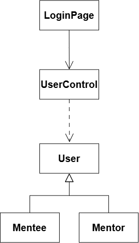

<i>Gambar 2. Diagram Kelas Use Case UC01</i>

 

| ID Kelas | Nama Kelas | Atribut | Metode/Operasi |
| :--- | :--- | :--- | :--- |
| *C01* | *User* | *idUser, username, profile, email, passwordHash* | *register(), login(), logout(), saveAccount()* |
| *C02* | *Mentor* | *listSessionsMade* | *inherit dari User* |
| *C03* | *Mentee* | *listSessionsJoined* | *inherit dari User* |
| *C12* | *UserControl* | *-* | *validateEmail(), authLogin(), processRegistration()* |
| *C15* | *LoginPage* | *-* | *showForm(), submitForm()* |

### 4.2.2 Use Case UC02
 
**Nama Use Case:** *Mengelola Preferensi Profil*
 
#### Identifikasi Kelas
 
| ID Kelas | Nama Kelas | Deskripsi Kelas |
| :--- | :--- | :--- |
| *C01* | *User* | *Kelas parent yang merepresentasikan pengguna aplikasi, menyimpan referensi terhadap Profile dan Preference miliknya.* |
| *C02* | *Mentor* | *Kelas turunan dari User yang merepresentasikan tutor sebaya.* |
| *C03* | *Mentee* | *Kelas turunan dari User yang merepresentasikan siswa.* |
| *C09* | *Preference* | *Kelas yang menyimpan pengaturan pengguna, seperti tag mata pelajaran, ketersediaan schedule, dan preferensi metode belajar (luring/daring) agar digunakan oleh algoritma matchmaking.* |
| *C10* | *Profile* | *Kelas yang merepresentasikan data identitas pengguna (nama, university, program studi, bio) yang dihubungkan dengan akun User.* |
 
#### Diagram Kelas
 

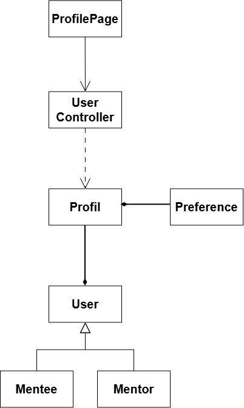

<i>Gambar 3. Diagram Kelas Use Case UC02</i>

 

| ID Kelas | Nama Kelas | Atribut | Metode/Operasi |
| :--- | :--- | :--- | :--- |
| *C01* | *User* | *userID, email, passwordHash* | *showPreference()* |
| *C02* | *Mentor* | *listSessionsMade* | *inherit dari User* |
| *C03* | *Mentee* | *attendedSessions* | *inherit dari User* |
| *C09* | *Preference* | *materialTag, avaiability, sessionTypePreference* | *updatePreference()* |
| *C10* | *Profile* | *name, university, studyProgram, bio* | *updateProfile()* |
| *C12* | *UserDatabase* | *accountList* | *saveProfile(), savePreference()* |

 
### 4.2.3 Use Case UC03
 
**Nama Use Case:** *Membuat Sesi Belajar*
 
#### Identifikasi Kelas
 
| ID Kelas | Nama Kelas | Deskripsi Kelas |
| :--- | :--- | :--- |
| *C02* | *Mentor* | *Kelas turunan dari User yang memiliki hak untuk membuat sesi baru, mengedit sesi, dan menghapus sesi.* |
| *C04* | *Session* | *Kelas yang merepresentasikan sesi belajar yang menyimpan atribut seperti topic materi, schedule, capacity, daftar peserta, dan status sesi.* |
| *C13* | *SessionDatabase* | *Kelas pengontrol yang bertanggung jawab menyimpan, memperbarui, dan memvalidasi tabrakan schedule Session.* |
 
#### Diagram Kelas
 

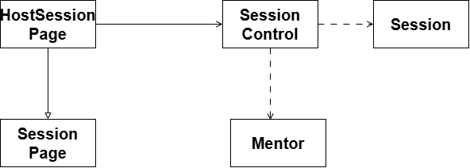

<i>Gambar 4. Diagram Kelas Use Case UC03</i>

 

| ID Kelas | Nama Kelas | Atribut | Metode/Operasi |
| :--- | :--- | :--- | :--- |
| *C02* | *Mentor* | *listSessionsMade* | *createSession()* |
| *C04* | *Session* | *sessionID, topic, schedule, format, capacity, userList, status* | *createSession(), setCapacity()* |
| *C13* | *SessionDatabase* | *sessionList* | *saveSession(), validateScheduleConflict()* |

 
### 4.2.4 Use Case UC04
 
**Nama Use Case:** *Mencari dan Bergabung ke Sesi*
 
#### Identifikasi Kelas
 
| ID Kelas | Nama Kelas | Deskripsi Kelas |
| :--- | :--- | :--- |
| *C03* | *Mentee* | *Kelas turunan dari User yang memiliki hak untuk mencari rekomendasi sesi, mendaftarkan diri ke sesi, serta membatalkan keikutsertaan sesi.* |
| *C04* | *Session* | *Kelas yang merepresentasikan sesi belajar yang menyimpan atribut seperti topic materi, schedule, capacity, daftar peserta, dan status sesi.* |
| *C09* | *Preference* | *Kelas yang menyimpan tag mata pelajaran dan ketersediaan schedule Mentee, digunakan sebagai dasar algoritma rekomendasi.* |
| *C11* | *Dashboard* | *Kelas antarmuka yang menampilkan rekomendasi matchmaking untuk Mentee.* |
| *C13* | *SessionDatabase* | *Kelas pengontrol yang mengambil data Session dan mencocokkannya dengan Preference untuk menghasilkan rekomendasi.* |
 
#### Diagram Kelas
 

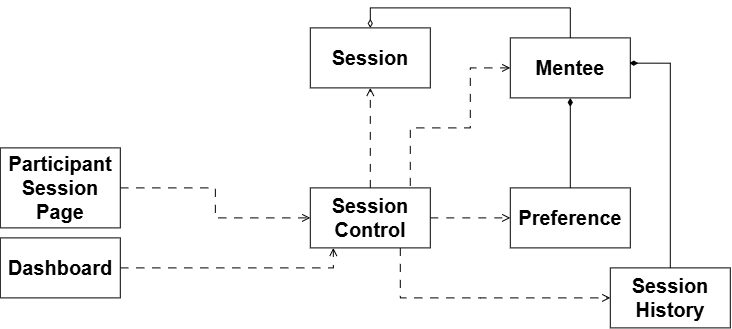

<i>Gambar 5. Diagram Kelas Use Case UC04</i>

 

| ID Kelas | Nama Kelas | Atribut | Metode/Operasi |
| :--- | :--- | :--- | :--- |
| *C03* | *Mentee* | *attendedSessions* | *joinSession(), cancelSession()* |
| *C04* | *Session* | *sessionID, topic, schedule, format, capacity, userList, status* | *addParticipant(), checkCapacity()* |
| *C09* | *Preference* | *materialTag, avaiability, sessionTypePreference* | *showPreference()* |
| *C11* | *Dashboard* | *sessionRecommendation* | *showRecommendation()* |
| *C13* | *SessionDatabase* | *sessionList* | *findRecommendation(), saveSession()* |

### 4.2.5 Use Case UC05
 
**Nama Use Case:** *Mengonfirmasi Keterlaksanaan Sesi*
 
#### Identifikasi Kelas
 
| ID Kelas | Nama Kelas | Deskripsi Kelas |
| :--- | :--- | :--- |  
| *C01* | *User* | *Kelas parent yang merepresentasikan pengguna aplikasi (Mentor, Mentee) yang menyimpan informasi akun dasar seperti profil, email university, kata sandi, preferensi materi, dan schedule.* | *UC01, UC02, UC05, UC06, UC07, UC08, UC09* |
| *C02* | *Mentor* | *Kelas turunan dari User yang merepresentasikan tutor sebaya. Kelas ini memiliki hak untuk membaut sesi baru, mengedit sesi, dan menghapus sesi.* | *UC01, UC02, UC03, UC05, UC06, UC07, UC08, UC09, UC11, UC12* |
| *C03* | *Mentee* | *Kelas turunan dari User yang merepresentasikan siswa. Memiliki hak untuk mencari rekomendasi sesi, mendaftarkan ke sesi, serta membatalkan ikutsertaan sesi* | *UC01, UC02, UC04, UC05, UC06, UC07, UC08, UC09, UC10* |
| *C04* | *Session* | *Kelas yang merepresentasikan sesi belajar yang menyimpan atribut seperti topic materi, schedule, capacity, daftar peserta, dan status sesi* | *UC03, UC04, UC05, UC09, UC10, UC11, UC12* |
| *C13* | *SessionDatabase* | *Kelas pengontrol yang mengambil data Session dan mencocokkannya dengan Preference untuk menghasilkan rekomendasi.* |
 
#### Diagram Kelas
 

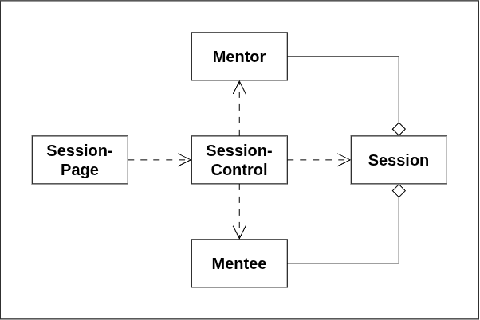

<i>Gambar 6. Diagram Kelas Use Case UC05</i>

 

| ID Kelas | Nama Kelas | Atribut | Metode/Operasi |
| :--- | :--- | :--- | :--- |
| *C03* | *Mentee* | *attendedSessions* | *joinSession(), cancelSession()* |
| *C04* | *Session* | *sessionID, topic, schedule, format, capacity, userList, status* | *addParticipant(), checkCapacity()* |
| *C09* | *Preference* | *materialTag, avaiability, sessionTypePreference* | *showPreference()* |
| *C11* | *Dashboard* | *sessionRecommendation* | *showRecommendation()* |
| *C13* | *SessionDatabase* | *sessionList* | *findRecommendation(), saveSession()* |

### 4.2.6 Use Case UC06
 
**Nama Use Case:** *Melihat Riwayat Sesi*
 
#### Identifikasi Kelas
 
| ID Kelas | Nama Kelas | Deskripsi Kelas |
| :--- | :--- | :--- |  
| *C01* | *User* | *Kelas parent yang merepresentasikan pengguna aplikasi (Mentor, Mentee) yang menyimpan informasi akun dasar seperti profil, email university, kata sandi, preferensi materi, dan schedule.* | *UC01, UC02, UC05, UC06, UC07, UC08, UC09* |
| *C02* | *Mentor* | *Kelas turunan dari User yang merepresentasikan tutor sebaya. Kelas ini memiliki hak untuk membaut sesi baru, mengedit sesi, dan menghapus sesi.* | *UC01, UC02, UC03, UC05, UC06, UC07, UC08, UC09, UC11, UC12* |
| *C03* | *Mentee* | *Kelas turunan dari User yang merepresentasikan siswa. Memiliki hak untuk mencari rekomendasi sesi, mendaftarkan ke sesi, serta membatalkan ikutsertaan sesi* | *UC01, UC02, UC04, UC05, UC06, UC07, UC08, UC09, UC10* |
| *C04* | *Session* | *Kelas yang merepresentasikan sesi belajar yang menyimpan atribut seperti topic materi, schedule, capacity, daftar peserta, dan status sesi* | *UC03, UC04, UC05, UC09, UC10, UC11, UC12* |
| *C07* | *SessionHistory* | *Kelas yang menyimpan kumpulan riwayat sesi milik seorang pengguna dengan mengelompokkannya berdasarkan status (Berlangsung, Terlaksana, Tidak Terlaksana).* | *UC06* |
| *C13* | *SessionDatabase* | *Kelas pengontrol yang mengambil data Session dan mencocokkannya dengan Preference untuk menghasilkan rekomendasi.* |
 
#### Diagram Kelas
 

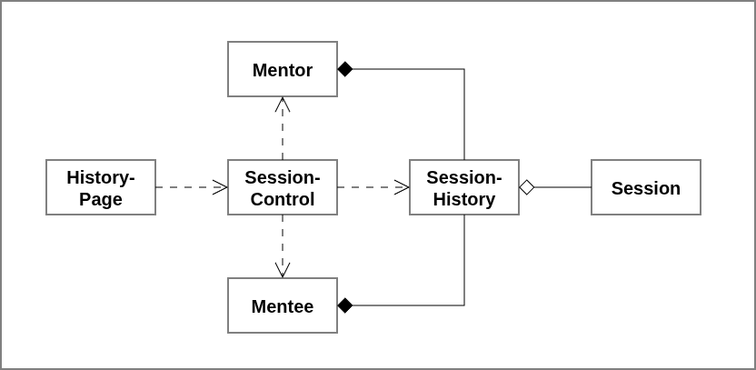

<i>Gambar 7. Diagram Kelas Use Case UC06</i>

 

| ID Kelas | Nama Kelas | Atribut | Metode/Operasi |
| :--- | :--- | :--- | :--- |
| *C03* | *Mentee* | *attendedSessions* | *joinSession(), cancelSession()* |
| *C04* | *Session* | *sessionID, topic, schedule, format, capacity, userList, status* | *addParticipant(), checkCapacity()* |
| *C07* | *SessionHistory* | *ongoingSessionList, completedSessionList, cancelledSessionList* | *showPreference()* |
| *C09* | *Preference* | *materialTag, avaiability, sessionTypePreference* | *getSessionDetails(idSesi : String)* |
| *C11* | *Dashboard* | *sessionRecommendation* | *showRecommendation()* |
| *C13* | *SessionDatabase* | *sessionList* | *findRecommendation(), saveSession()* |

### 4.2.7 Use Case UC07
 
**Nama Use Case:** *Memberikan Penilaian Sehabis Sesi*
 
#### Identifikasi Kelas
 
| ID Kelas | Nama Kelas | Deskripsi Kelas |
| :--- | :--- | :--- |
| *C02* | *Mentor* | *Kelas turunan dari User yang merepresentasikan tutor sebaya. Kelas ini memiliki hak untuk membaut sesi baru, mengedit sesi, dan menghapus sesi.* |
| *C03* | *Mentee* | *Kelas turunan dari User yang merepresentasikan siswa. Memiliki hak untuk mencari rekomendasi sesi, mendaftarkan ke sesi, serta membatalkan ikutsertaan sesi* |
| *C06* | *Feedback* | *Kelas yang merepresentasikan rating dan ulasan yang diberikan oleh Mentee ataupun Mentor pada saat sebuah sesi belajar telah selesai.* |
| *C14* | *FeedbackDatabase* | *Kelas pengontrol yang bertanggung jawab menyimpan dan memperbarui penilaian yang dibuat oleh Mentee terhadap sesi yang diikuti.* |
 
#### Diagram Kelas
 

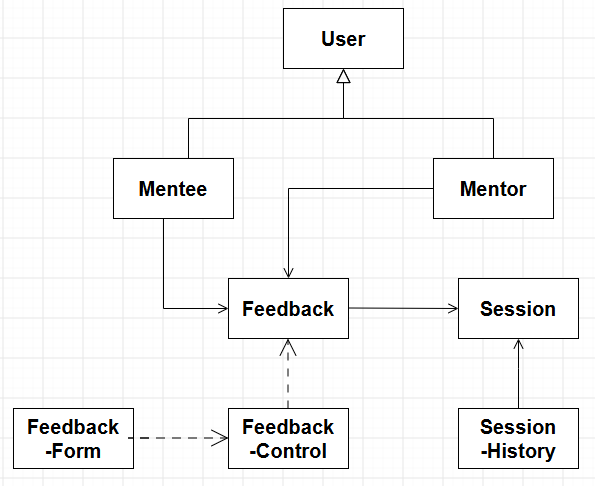

<i>Gambar 7. Diagram Kelas Use Case UC07</i>

 
Pada diagram kelas, cukup tampilkan nama kelas saja. Atribut dan metode/operasi milik setiap kelas dapat dituliskan pada tabel di bawah ini. Pastikan hubungan antarkelas menggunakan jenis relasi yang sesuai (asosiasi, agregasi, komposisi, generalisasi, atau dependensi).
 
| ID Kelas | Nama Kelas | Atribut | Metode/Operasi |
| :--- | :--- | :--- | :--- |
| *C03* | *Mentee* | *daftarSesiDiikuti* | *joinSession(), cancelSession()* |
| *C04* | *Session* | *idSesi, topik, jadwal, format, kapasitas, daftarPeserta, status* | *addParticipant(), checkCapacity()* |
| *C09* | *Preference* | *tagMateri, ketersediaanJadwal, preferensiFormatSesi* | *showPreference()* |
| *C11* | *Dashboard* | *rekomendasiSesi* | *showRecommendation()* |
| *C13* | *SessionDatabase* | *daftarSesi* | *findRecommendation(), saveSession()* |

### 4.2.8 Use Case UC08
 
**Nama Use Case:** *Berkomunikasi Menggunakan Grup Obrolan Sementara*
 
#### Identifikasi Kelas
 
| ID Kelas | Nama Kelas | Deskripsi Kelas |
| :--- | :--- | :--- |
| *C05* | *GroupChat* | *Kelas yang merepresentasikan ruang obrolan sementara untuk komunikasi antar pengguna.* |
| *C21* | *GroupChatPage* | *Kelas antarmuka yang menampilkan antarmuka kotak pesan dan riwayat obrolan antarpengguna.* |
| *C04* | *Session* | *Kelas yang merepresentasikan sesi belajar yang menyimpan atribut seperti topik materi, jadwal, kapasitas, daftar peserta, dan status sesi* |
| *C08* | *ChatMessage* | *Kelas yang merepresentasikan pesan yang dikirimkan oleh pengguna ke dalam sebuah GroupChat. Menyimpan informasi pengirim, isi pesan teks, dan timestamp pesan dikirim.* |
| *C01* | *User* | *Kelas parent yang merepresentasikan pengguna aplikasi (Mentor, Mentee) yang menyimpan informasi akun dasar seperti profil, email universitas, kata sandi, preferensi materi, dan jadwal.* |
 
#### Diagram Kelas
 

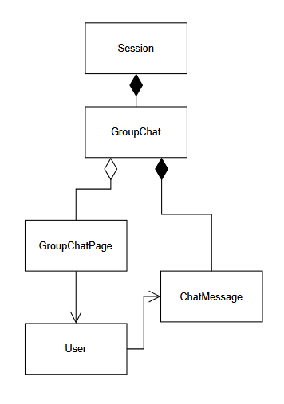

<i>Gambar 9. Diagram Kelas Use Case UC08</i>

 
Pada diagram kelas, cukup tampilkan nama kelas saja. Atribut dan metode/operasi milik setiap kelas dapat dituliskan pada tabel di bawah ini. Pastikan hubungan antarkelas menggunakan jenis relasi yang sesuai (asosiasi, agregasi, komposisi, generalisasi, atau dependensi).
 
| ID Kelas | Nama Kelas | Atribut | Metode/Operasi |
| :--- | :--- | :--- | :--- |
| *C05* | *GroupChat* | *listChatMessage, listMentee, Mentor* | *searchMessage(), editMessage(), deleteMessage()* |
| *C21* | *GroupChatPage* | *-* | *displayMessage()* |
| *C04* | *Session* | *groupChat* | *openGroupChat()* |
| *C08* | *ChatMessage* | *sender, timeStamp, text* | *getSender(), getTime(), getText()* |
| *C01* | *User* | *listSession* | *openSessionDashboard(), createMessage(), sendMessage()* |

### 4.2.9 Use Case UC09
 
**Nama Use Case:** *Menerima notifikasi sesi*
 
#### Identifikasi Kelas
 
| ID Kelas | Nama Kelas | Deskripsi Kelas |
| :--- | :--- | :--- |
| *C22* | *Notification* | *Kelas yang merepresentasikan pesan pengingat dari sistem yang menyimpan detail pesan, waktu, dan status terbaca* |
| *C04* | *Session* | *Kelas yang merepresentasikan sesi belajar yang menyimpan atribut seperti topik materi, jadwal, kapasitas, daftar peserta, dan status sesi* |
| *C11* | *Dashboard* | *Kelas antarmuka utama yang menampilkan rangkuman jadwal sesi terdekat, notifikasi, dan rekomendasi matchmaking untuk Mentee.* |
| *C01* | *User* | *Kelas parent yang merepresentasikan pengguna aplikasi (Mentor, Mentee) yang menyimpan informasi akun dasar seperti profil, email universitas, kata sandi, preferensi materi, dan jadwal.* |
 
#### Diagram Kelas
 

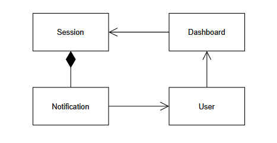

<i>Gambar 10. Diagram Kelas Use Case UC09</i>

 
Pada diagram kelas, cukup tampilkan nama kelas saja. Atribut dan metode/operasi milik setiap kelas dapat dituliskan pada tabel di bawah ini. Pastikan hubungan antarkelas menggunakan jenis relasi yang sesuai (asosiasi, agregasi, komposisi, generalisasi, atau dependensi).
 
| ID Kelas | Nama Kelas | Atribut | Metode/Operasi |
| :--- | :--- | :--- | :--- |
| *C22* | *Notification* | *notificationId, title, content, timestamp, isRead* | *markAsRead(), showContent(), getTime(), openApp()* |
| *C04* | *Session* | *scheduledTime* | *pushNotification()* |
| *C11* | *Dashboard* | *-* | *showSession(), matchMakeSession(), searchSession(), checkSchedule()* |
| *C01* | *User* | *-* | *openDashboard()* |

### 4.2.10 Use Case UC10
 
**Nama Use Case:** *Membatalkan Keikutsertaan Sesi*
 
#### Identifikasi Kelas
 
| ID Kelas | Nama Kelas | Deskripsi Kelas |
| :--- | :--- | :--- |
| *C04* | *Session* | *Kelas yang merepresentasikan sesi belajar yang menyimpan atribut seperti topik materi, jadwal, kapasitas, daftar peserta, dan status sesi* |
| *C19* | *ParticipantSessionPage* | *Kelas turunan dari SessionPage tempat Mentee dapat membatalkan untuk mengikuti sesi* |
| *C07* | *SessionHistory* | *Kelas yang menyimpan kumpulan riwayat sesi milik seorang pengguna dengan mengelompokkannya berdasarkan status (Berlangsung, Terlaksana, Tidak Terlaksana).* |
| *C13* | *SessionControl* | *Kelas pengontrol yang menangani tabrakan jadwal, menjalankan algoritma matchmaking, dan memproses pendaftaran atau pembuatan sesi.* |
| *C01* | *Mentee* | *Kelas turunan dari User yang merepresentasikan siswa. Memiliki hak untuk mencari rekomendasi sesi, mendaftarkan ke sesi, serta membatalkan ikutsertaan sesi* |
 
#### Diagram Kelas
 

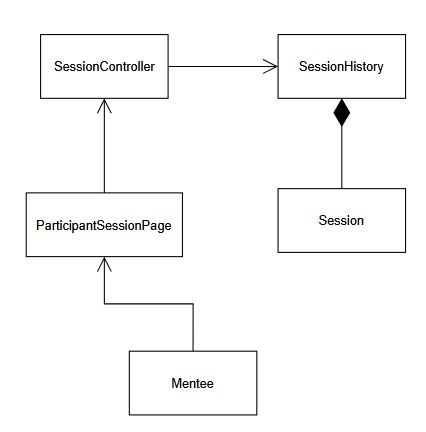

<i>Gambar 11. Diagram Kelas Use Case UC10</i>

 
Pada diagram kelas, cukup tampilkan nama kelas saja. Atribut dan metode/operasi milik setiap kelas dapat dituliskan pada tabel di bawah ini. Pastikan hubungan antarkelas menggunakan jenis relasi yang sesuai (asosiasi, agregasi, komposisi, generalisasi, atau dependensi).
 
| ID Kelas | Nama Kelas | Atribut | Metode/Operasi |
| :--- | :--- | :--- | :--- |
| *C04* | *Session* | *listMentee* | *removeMentee()* |
| *C19* | *ParticipantSessionPage* | *-* | *-* |
| *C07* | *SessionHistory* | *oncomingSession* | *-* |
| *C13* | *SessionControl* | *sessionHistory* | *cancelSession()* |
| *C03* | *Mentee* | *listSession* | *-* |

### 4.2.11 Use Case UC11
 
**Nama Use Case:** *Menghapus Sesi*
 
#### Identifikasi Kelas
 
| ID Kelas | Nama Kelas | Deskripsi Kelas |
| :--- | :--- | :--- |
| *C04* | *Session* | *Kelas yang merepresentasikan sesi belajar yang menyimpan atribut seperti topik materi, jadwal, kapasitas, daftar peserta, dan status sesi* |
| *C13* | *SessionControl* | *Kelas pengontrol yang menangani tabrakan jadwal, menjalankan algoritma matchmaking, dan memproses pendaftaran atau pembuatan sesi.* |
| *C07* | *SessionHistory* | *Kelas yang menyimpan kumpulan riwayat sesi milik seorang pengguna dengan mengelompokkannya berdasarkan status (Berlangsung, Terlaksana, Tidak Terlaksana).* |
| *C18* | *HostSessionPage* | *Kelas turunan dari SessionPage sebagai tempat Mentor dapat melakukan pembaruan data atau penghapusan.* |
| *C02* | *Mentor* | *Kelas turunan dari User yang merepresentasikan tutor sebaya. Kelas ini memiliki hak untuk membaut sesi baru, mengedit sesi, dan menghapus sesi.* |
 
#### Diagram Kelas
 

<i>Gambar 12 Diagram Kelas Use Case UC11</i>

 
Pada diagram kelas, cukup tampilkan nama kelas saja. Atribut dan metode/operasi milik setiap kelas dapat dituliskan pada tabel di bawah ini. Pastikan hubungan antarkelas menggunakan jenis relasi yang sesuai (asosiasi, agregasi, komposisi, generalisasi, atau dependensi).
 
| ID Kelas | Nama Kelas | Atribut | Metode/Operasi |
| :--- | :--- | :--- | :--- |
| *C04* | *Session* | *sessionId* | *getSessionId()* |
| *C13* | *SessionControl* | *sessionHistory* | *deleteSession()* |
| *C07* | *SessionHistory* | *oncomingSession* | *-* |
| *C18* | *HostSessionPage* | *-* | *-* |
| *C02* | *Mentor* | *listSession* | *-* |

### 4.2.12 Use Case UC12
 
**Nama Use Case:** *Mengedit Sesi*
 
#### Identifikasi Kelas
 
| ID Kelas | Nama Kelas | Deskripsi Kelas |
| :--- | :--- | :--- |
| *C04* | *Session* | *Kelas yang merepresentasikan sesi belajar yang menyimpan atribut seperti topik materi, jadwal, kapasitas, daftar peserta, dan status sesi* |
| *C13* | *SessionControl* | *Kelas pengontrol yang menangani tabrakan jadwal, menjalankan algoritma matchmaking, dan memproses pendaftaran atau pembuatan sesi.* |
| *C07* | *SessionHistory* | *Kelas yang menyimpan kumpulan riwayat sesi milik seorang pengguna dengan mengelompokkannya berdasarkan status (Berlangsung, Terlaksana, Tidak Terlaksana).* |
| *C18* | *HostSessionPage* | *Kelas turunan dari SessionPage sebagai tempat Mentor dapat melakukan pembaruan data atau penghapusan.* |
| *C02* | *Mentor* | *Kelas turunan dari User yang merepresentasikan tutor sebaya. Kelas ini memiliki hak untuk membaut sesi baru, mengedit sesi, dan menghapus sesi.* |
 
#### Diagram Kelas
 

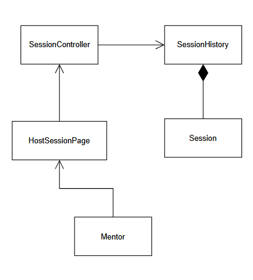

<i>Gambar 13. Diagram Kelas Use Case UC12</i>

 
Pada diagram kelas, cukup tampilkan nama kelas saja. Atribut dan metode/operasi milik setiap kelas dapat dituliskan pada tabel di bawah ini. Pastikan hubungan antarkelas menggunakan jenis relasi yang sesuai (asosiasi, agregasi, komposisi, generalisasi, atau dependensi).
 
| ID Kelas | Nama Kelas | Atribut | Metode/Operasi |
| :--- | :--- | :--- | :--- |
| *C04* | *Session* | *sessionTitle, description, preference, schedule* | *editTitle(), editDescription(), editPreference(), editSchedule()* |
| *C13* | *SessionControl* | *session* | *editSession()* |
| *C07* | *SessionHistory* | *oncomingSession* | *updateOncomingSession()* |
| *C18* | *HostSessionPage* | *-* | *-* |
| *C02* | *Mentor* | *listsession* | *-* |

> Lanjutkan pola **4.2.x** untuk setiap use case pada 3.2.

| ID Kelas | Nama Kelas | Atribut | Metode/Operasi |
| :--- | :--- | :--- | :--- |
| *C02* | *Mentor* | *sessionID, topic, schedule, format, capacity, userList, status* | *inherit dari User* |
| *C03* | *Mentee* | *materialTag, availibility, sessionTypePreference* | *inherit dari User* |
| *C06* | *Feedback* | *idFeedback, author, target, content, score* | *showRecommendation()* |
| *C07* | *SessionHistory* | ** | ** |

## 4.3 Diagram Kelas Keseluruhan

Gabungkan seluruh kelas dan hubungan antarkelas dari diagram kelas setiap use case menjadi satu diagram kelas keseluruhan. Pastikan tidak ada kelas yang terduplikasi.

<i>Gambar X. Diagram Kelas Keseluruhan</i>

 

| ID Kelas | Nama Kelas | Atribut | Metode/Operasi |
| :--- | :--- | :--- | :--- |
| *C01* | *Pelanggan* | *idPelanggan, nama, email* | *lihatRiwayatPesanan()* |
| *C02* | *Pesanan* | *idPesanan, total, status* | *hitungTotal(), perbaruiStatus()* |
| *C03* | *Keranjang* | *daftarItem* | *tambahItem(), checkout()* |
| *C04* | *MetodePembayaran* | *-* | *kirimKePaymentGatewayDummy()* |
| *C05* | *Kartu* | *nomorKartu, masaBerlaku* | *kirimKePaymentGatewayDummy()* |
| *C06* | *EWallet* | *saldo, idAkun* | *cekSaldo(), kirimKePaymentGatewayDummy()* |
| *C07* | *RiwayatTransaksi* | *idTransaksi, waktu, status* | *catatTransaksi(), tampilkanNotifikasi()* |
| *...* | *...* | *...* | *...* |

---

# BAB 5: Traceability
Cocokkan setiap kebutuhan fungsional, use case, dengan diagram kelas yang mendukung atau mengimplementasikan kebutuhan tersebut.

| ID Kelas | ID Use Case | ID KF |
| :--- | :--- | :--- |
| *C01* | *UC01, UC05* | *KF01, KF06* |
| *C02* | *UC01, UC03, UC05* | *KF01, KF02, KF05, KF06* |
| *C03* | *UC01, UC02* | *KF01, KF02* |
| *C04* | *UC03, UC04* | *KF03* |
| *C05* | *UC03, UC04* | *KF03* |
| *C06* | *UC03, UC04* | *KF03, KF04* |
| *C07* | *UC03, UC05* | *KF04, KF05* |
| *...* | *...* | *...* |

---

# Referensi

- Diagram UML: [https://www.drawio.com/](https://www.drawio.com/), [https://staruml.io/](https://staruml.io/)