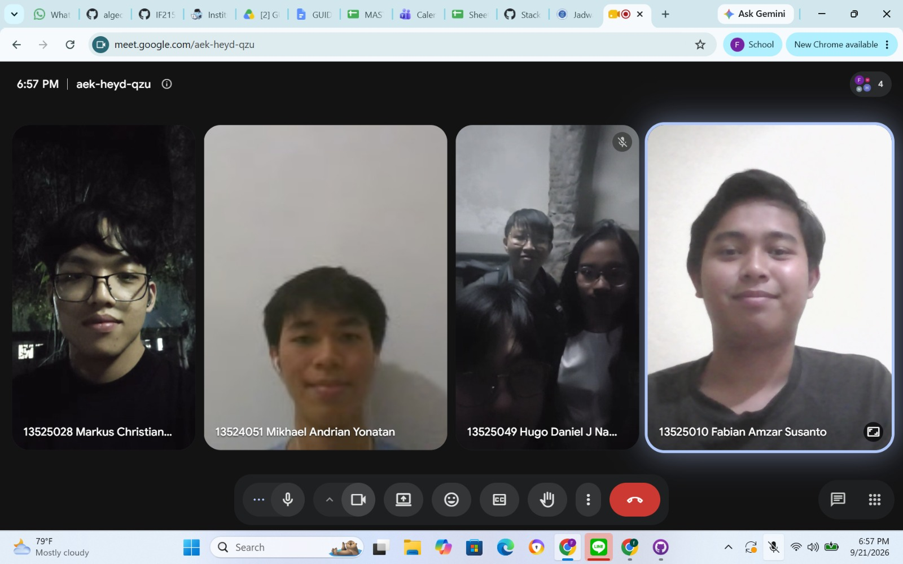

# Form Asistensi

## Tugas Besar IF2150 - Rekayasa Perangkat Lunak

| Informasi                | Keterangan  |
| ------------------------ | ----------- |
| **Hari**                 | Senin       |
| **Tanggal**              | 07/09/2026  |
| **Kelas**                | K-1         |
| **Nomor Kelompok**       | 9           |
| **Nama Kelompok**        | PindahCSUI  |
| **Nama Perangkat Lunak** | PeerUp      |
| **Dokumen**              | Milestone 3 |

### Anggota Kelompok

| NIM      | Nama                            |
| -------- | ------------------------------- |
| 13525049 | Hugo Daniel Johansen Napitupulu |
| 13525028 | Markus Christiano Simanjutak    |
| 13525025 | David Christian                 |
| 13525001 | Matthew Allen Reynaldo          |
| 13525010 | Fabian Amzar Susanto            |

### Catatan

--- 
Di tugas ini utamanya adalah buat class diagram, pembuatan class diagram bukan berarti implementasinya harus pake gaya OOP karena pengembangan di platform web (platform yang dipilih mayoritas dari kalian) itu sekarang gampangnya pake pendekatan fungsional, tapi kalau mau coba bener-bener OOP juga boleh aja (latihan buat semester depan). Makna dari pembuatan class diagram itu buat mendefinisikan hubungan dan tanggung jawab. Di tugas ini, kalian bisa analisis kelas apa aja yang dibutuhin dari setiap use casenya.
Seperti yang kalian udah tau, ada beberapa jenis kelas, yaitu
* Entity class, ini kelas yang biasanya disimpen dan dimanipulasi
* Boundary class, ini kelas yang berhubungan sama client  
* Controller class, ini kelas yang menjadi perantara antara entity sama boundary
Gampangnya kalau diliat dari web dev...
* Boundary class = frontend (client)
* Controller class = backend (API and services)
* Entity class = business data (database)
Client-side = boundary ; Server-side = controller dan entity
Buat lebih jelasnya ini yah,

1. Association
- Visual: Garis solid dengan panah terbuka ( > )
* Arah Panah: Nunjuk dari kelas pemilik ke kelas yang dimiliki/diketahui
* Kasus penggunaan: Saat dua kelas saling berinteraksi secara struktural
* Contoh: Kelas User memiliki relasi dengan SubscriptionPlan artinya pengguna memiliki paket langganan tertentu (ini bukan agregasi atau komposisi karena User enggak dibangun dari SubscriptionPlan)

2. Dependency (Kebergantungan Lemah)
- Visual: Garis putus-putus dengan panah terbuka ( > ).
- Arah Panah: Menunjuk dari kelas yang membutuhkan ke kelas yang dibutuhkan.
- Kasus penggunaan: Kelas A menggunakan Kelas B hanya sesaat (misalnya dipanggil di dalam fungsi), tapi tidak menyimpannya secara permanen.
- Contoh: Kelas RegistrationPage bergantung pada kelas EmailValidator. RegistrationPage hanya memanggil kelas EmailValidator ketika ingin digunakan saja.

3. Aggregation (Keseluruhan-Bagian Longgar)
- Visual: Garis solid dengan belah ketupat kosong di ujungnya.
- Arah Panah: Belah ketupat menempel pada kelas pemilik (keseluruhan).
- Kasus penggunaan: Hubungan bagian dari (has-a), namun siklus hidup kelas yang dimiliki bisa berdiri sendiri meskipun pemiliknya dihapus.
- Contoh: ProductCatalogPage memuat banyak kartu yang menggunakan data Product. Jika ProductCatalogPage dihapus, kelas Product tersebut tetap ada dan utuh di dalam sistem (maknanya Product tidak butuh ProductCatalogPage untuk menjadi berarti eak)

4. Composition (Keseluruhan-Bagian Ketat)
- Visual: Garis solid dengan belah ketupat hitam di ujungnya.
- Arah Panah: Belah ketupat menempel pada kelas pemilik mutlak.
- Kasus penggunaan: Hubungan bagian dari (has-a) yang tidak bisa dipisahkan; jika pemilik hancur, kelas yang dimiliki wajib ikut hancur.
- Contoh: Kelas ProductCatalogPage memiliki kelas ProductCard. Jika ProductCatalogPage dihapus, kelas ProductCard juga ikutan (maknanya ProductCard tidak akan berarti tanpa ProductCatalogPage hiks)

5. Generalization (Pewarisan / Inheritance):
- Visual: Garis solid dengan segitiga kosong
- Arah Panah: Nunjuk dari kelas anak ke kelas induk
- Kasus penggunaan: Kelas induk mewarisi atribut dan methodnya ke kelas anak
- Contoh: Kelas Admin dan Customer mewarisi properti dasar (seperti email, password, dan metode login()) dari kelas induk User.

6. Realization (Interface)
* Visual: Garis putus-putus dengan segitiga kosong
* Arah Panah: Nunjuk dari kelas yang mengimplementasikan ke interface
* Kasus penggunaan: Kelas induk mewarisi atribut dan methodnya ke kelas anak
* Contoh: Kelas DataBaseConnection mengimplementasikan interface IDatabase yang mewajibkan keduanya memiliki fungsi connect() dan query().

**Notes for this section:**  
*Catatan dapat dituliskan dalam bentuk paragraf atau poin-poin, disesuaikan saja.* 

## Dokumentasi

<!--  -->

  

  <i>Gambar 1. Dokumentasi kegiatan asistensi.</i>

