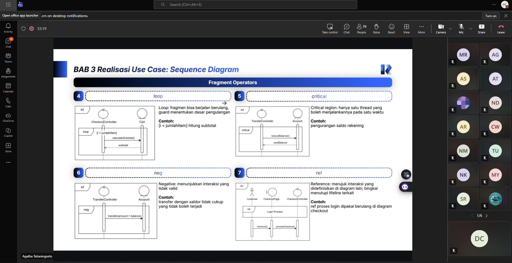

# Form Asistensi

## Tugas Besar IF2150 - Rekayasa Perangkat Lunak

| Informasi | Keterangan |
| --- | --- |
| **Hari** | *\[Hari\]* |
| **Tanggal** | *\[DD/MM/YYYY\]* |
| **Kelas** | *\[Kelas\]* |
| **Nomor Kelompok** | *\[Nomor Kelompok\]*  |
| **Nama Kelompok** | *\[Nama Kelompok\]*  |
| **Nama Perangkat Lunak** | *\[Nama P/L\]*  |
| **Dokumen** | *\[Nama Dokumen yang diasistensikan\]*  |

### Anggota Kelompok

| NIM | Nama |
| --- | --- |
| *\[NIM 1\]* | *\[Nama Anggota 1\]* |
| *\[NIM 2\]* | *\[Nama Anggota 2\]* |
| *\[NIM 3\]* | *\[Nama Anggota 3\]* |
| *\[NIM 4\]* | *\[Nama Anggota 4\]* |
| *\[NIM 5\]* | *\[Nama Anggota 5\]* |

### Catatan

| Catatan |
| --- |
| 1. deadline 21 oktober  |
| 2. 1 use case bisa mencakup beberapa fragmen |
| 3. 1 use case bisa beberapa diagram jika 1 diagram dianggap terlalu padat |
| 4. ... |

**Notes for this section:**  
*Catatan dapat dituliskan dalam bentuk paragraf atau poin-poin, disesuaikan saja.* 

## Dokumentasi

<!--  -->

  

  <i>Gambar 1. Dokumentasi kegiatan asistensi.</i>

